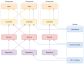

# Заметки 

## 1. Описание

### 1.1 Цель создания приложения

Приложение написано после прочтения статьи на
Хабре : [Чистая Архитектура для веб-приложений](https://habr.com/ru/post/493430/) 
.

Захотелось попробовать чистую архитектуру в действии.

В данном репозитории используется фреймворк React .

Также приложение реализовано на фреймворках Angular  и Vue  (в
других моих репозиториях).

### 1.2 Про приложение

Само приложение представляет собой SPA  приложение для заметок.

Каждая заметка имеет название и список задач. Каждая
задача имеет текст и чекбокс, говорящий о её завершённости.

На главной странице показано количество заметок.

На странице "Все заметки" показан список всех заметок. У каждой заметки показано только 3 первые задачи. Можно открыть
заметку и посмотреть все задачи в ней.

На странице "Новая заметка" можно создать заметку: ввести заголовок заметки, добавить задачи, ввести их заголовки и их
статус - завершённые или нет.

Также заметку можно отредактировать, изменяя данные в ней. При сохранении изменений или удалении заметки появляется
модальное окно с подтверждением действия.

Заметки сохраняются в Local Storage браузера.

Также при создании новой заметки или редактировании существующей имеется возможность выполнить отмену/повтор последних
действий.

### 1.3 Стили

Для стилизации используется библиотека Bootstrap .

### 1.4 Язык программирования

Приложение написано на языке Typescript .

### 1.5 Фреймворк

Фронтенд-фреймворк - React .

## 2. Настройка приложения с нуля 

### 2.1 Создать папку **todos_react**

### 2.2 Создать приложение react

* **npx create-react-app . --template typescript**

### 2.3 Установить зависимости

* **npm i -D eslint**
* **npm i -D eslint-plugin-react-hooks**

* **npm i -D prettier** 
* **npm i -D eslint-config-prettier eslint-plugin-prettier**

* **npm i bootstrap@5.3.0-alpha1**
* **npm i bootstrap-icons**

* **npm i first-di**
* **npm i class-validator**
* **npm i reflect-metadata**
* **npm i ts-serializable**
* **npm i typeorm**

* **npm i react-router-dom**
* **npm i axios**

### 2.4 Инициализировать eslint :

* **npx eslint --init**

### 2.5 Добавить в файл .eslintrc.json:

```
{
  "extends": [
    // ...
    "plugin:prettier/recommended",
    "prettier"
  ],
  "plugins": [
    // ...
    "react-hooks",
    "prettier"
  ],
  "rules": {
    "react-hooks/rules-of-hooks": "error",
    "react-hooks/exhaustive-deps": "warn",
    "prettier/prettier": "error",
    "react/prop-types": "off"
  }
}
```

### 2.6 Добавить в файл .prettierrc:

```
{
  "semi": true,
  "trailingComma": "none",
  "singleQuote": false,
  "printWidth": 80,
  "tabWidth": 2,
  "useTabs": false,
  "arrowParens": "avoid"
}
```

### 2.7 В файле tsconfig.json включить:

```
{
  "compilerOptions": {
    "emitDecoratorMetadata": true, // Позволяет генерировать рефлексию
    "experimentalDecorators": true, // Включает поддержку декораторов
  }
}
```

### 2.8 В IDE  включить опции:

#### Settings/Languages & Frameworks/Javascript/Prettier:

* Prettier package: выбрать текущий каталог - **...\node_modules\prettier**
* поставить галочку - **On 'Reformat Code' action**
* поставить галочку - **On save**

#### Settings/Tools/Action on Save:

* поставить галочку - **Reformat code**
* поставить галочку - **Run eslint --fix**

### 2.9 Добавить в файл ./src/index.ts:

```
import "bootstrap/dist/css/bootstrap.min.css";
import "bootstrap/dist/js/bootstrap.min.js";
import "bootstrap-icons/font/bootstrap-icons.css";
import './index.css';
```

### 2.10 Настройка тестов

2.10.1 Установить зависимости:

* **npm i enzyme enzyme-to-json enzyme-adapter-react-16 react-test-renderer**
* **npm i -D @types/enzyme**
* **npm i -D jest-extended**
* **npm i -D @cfaester/enzyme-adapter-react-18**

* **npm i cypress**

2.10.2 Добавить в файл package.json:

```
  "scripts": {
	  "cypress": "node_modules/.bin/cypress open", 
```

2.10.3 Добавить в файл ./src/setupTests.js:

```
import {configure} from "enzyme";
import Adapter from "enzyme-adapter-react-16";

configure({adapter: new Adapter()});

const config = {
  "jest": {
    "setupTestFrameworkScriptFile": "jest-extended"
  }
}

export default config;
```

2.10.4 Добавить в файл package.json (возможно не надо добавлять, если будет ошибка?):

```
  "jest": {
    "transformIgnorePatterns": [
      "node_modules/(?!ts-serializable)",
      "node_modules/(?!first-di)"
    ]
  }
```

2.10.5 Обновить библиотеки до последних версий:

* **npm i -D @testing-library/react@latest**
* **npm i -D @testing-library/jest-dom@latest**
* **npm i -D @testing-library/user-event@latest**
